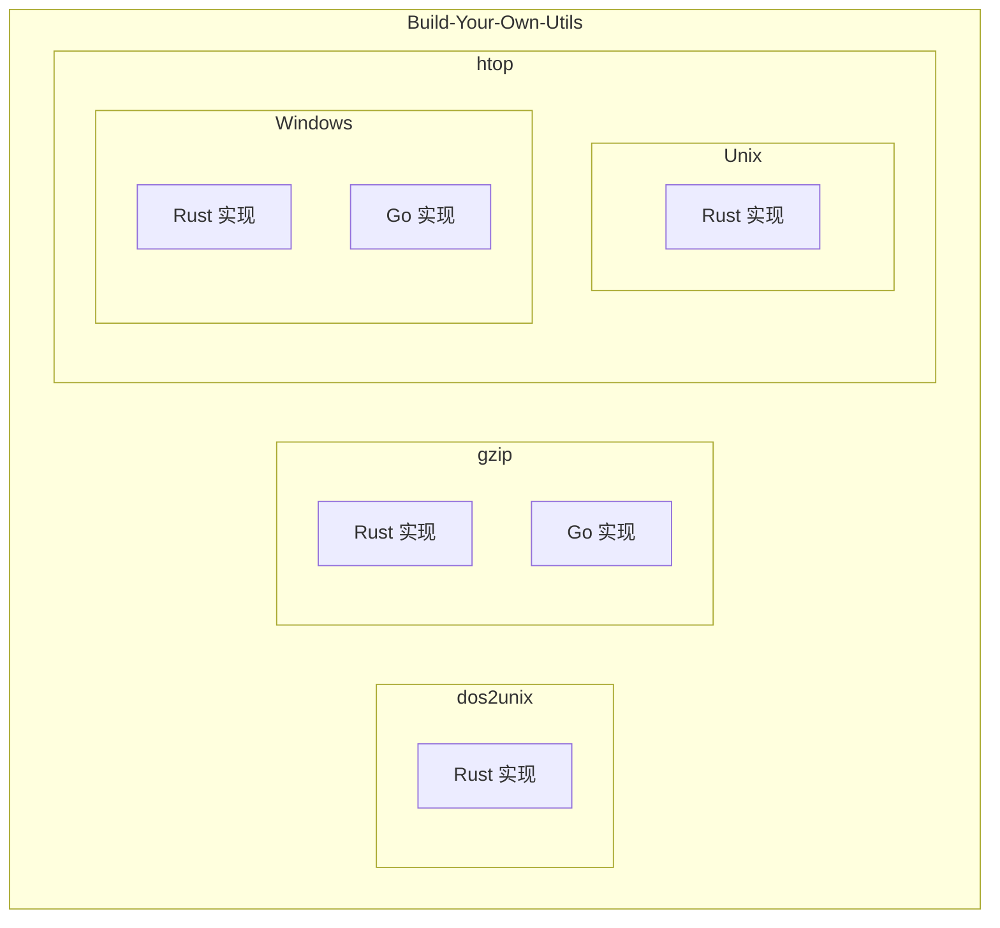

# Build-Your-Own-Utils

[](https://github.com/user/Build-Your-Own-Utils/actions/workflows/ci.yml)
[](LICENSE)
[](https://www.rust-lang.org/)
[](https://golang.org/)

一个用 Rust / Go 手写常用命令行工具的学习仓库，用于练习底层实现、命令行设计与跨语言对比。

## ✨ 特性

- 🦀 **Rust 实现** - 高性能、内存安全的系统级实现
- 🐹 **Go 实现** - 简洁高效的并发友好实现
- 📚 **学习导向** - 代码清晰易读，适合学习底层原理
- 🔧 **实用工具** - 可直接用于日常开发的命令行工具
- 🌍 **跨平台** - 支持 Linux、macOS、Windows

## 📦 子项目

| 项目 | 描述 | 语言 | 状态 |
|------|------|------|------|
| [dos2unix](./dos2unix/) | CRLF 转 LF 换行符转换工具 | Rust | ✅ |
| [gzip](./gzip/) | 文件压缩/解压工具 | Rust, Go | ✅ |
| [htop](./htop/) | 系统进程监控工具 | Rust, Go | ✅ |

## 🏗️ 架构



## 🚀 快速开始

### 前置依赖

- [Rust](https://www.rust-lang.org/tools/install) 1.70+
- [Go](https://golang.org/dl/) 1.20+

### 构建所有项目

```bash
# 克隆仓库
git clone https://github.com/user/Build-Your-Own-Utils.git
cd Build-Your-Own-Utils

# 构建所有 Rust 项目
make build-rust

# 构建所有 Go 项目
make build-go
```

### 单独构建

```bash
# dos2unix (Rust)
cd dos2unix && cargo build --release

# gzip (Go)
cd gzip/go && make build

# gzip (Rust)
cd gzip/rust && cargo build --release

# htop Unix (Rust)
cd htop/unix/rust && cargo build --release

# htop Windows (Go)
cd htop/win/go && go build ./...
```

## 📖 使用示例

### dos2unix

```bash
# 转换单个文件
dos2unix-rust file.txt

# 检测文件是否包含 CRLF
dos2unix-rust --check file.txt

# 从标准输入读取
cat file.txt | dos2unix-rust > output.txt
```

### gzip

```bash
# 压缩文件 (Go 版)
gzip-go file.txt

# 解压文件 (Rust 版)
rgzip -d file.txt.gz
```

### htop

```bash
# 运行系统监控 (Unix)
htop-unix-rust

# 运行系统监控 (Windows)
htop-win-go
```

## 🛠️ 开发

### 代码检查

```bash
# Rust
cargo fmt --all
cargo clippy --all-targets -- -D warnings
cargo test --all

# Go
gofmt -w .
go vet ./...
go test ./...
```

### 运行所有测试

```bash
make test-all
```

## 📁 目录结构

```
Build-Your-Own-Utils/
├── dos2unix/           # Rust 实现的 dos2unix
├── gzip/
│   ├── go/             # Go 实现
│   └── rust/           # Rust 实现
├── htop/
│   ├── unix/rust/      # Unix Rust 实现
│   └── win/
│       ├── go/         # Windows Go 实现
│       └── rust/       # Windows Rust 实现
├── docs/               # 项目文档
├── .github/            # GitHub 配置
├── CHANGELOG.md        # 变更日志
├── CONTRIBUTING.md     # 贡献指南
├── CODE_OF_CONDUCT.md  # 行为准则
└── SECURITY.md         # 安全政策
```

## 🤝 贡献

欢迎贡献！请阅读 [CONTRIBUTING.md](CONTRIBUTING.md) 了解如何参与项目开发。

## 📄 许可证

本项目采用 [MIT](LICENSE) 或 [Apache-2.0](LICENSE) 双许可证，你可以选择其中之一。

## 🙏 致谢

感谢所有贡献者和开源社区的支持！
