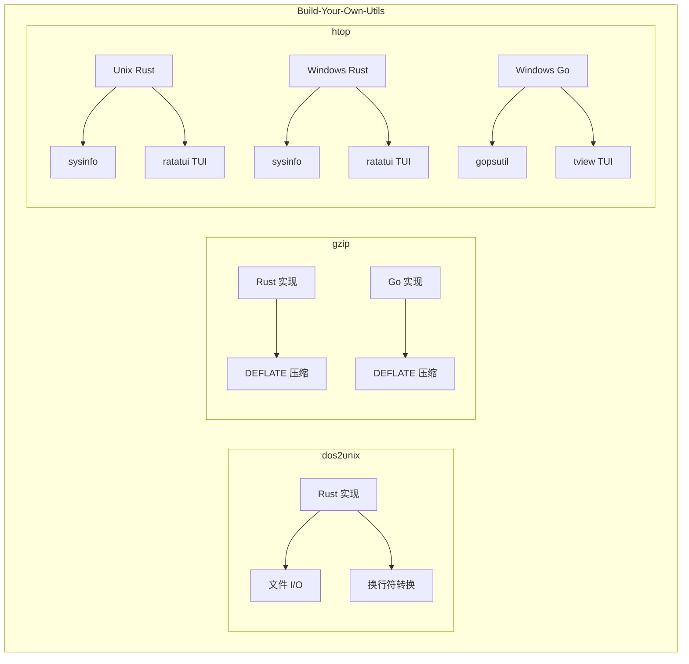
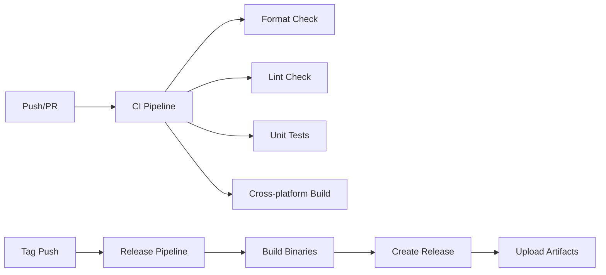

# 架构说明

本文档描述 Build-Your-Own-Utils 项目的整体架构和设计理念。

## 项目概述

Build-Your-Own-Utils 是一个学习型项目，通过手写常用命令行工具来深入理解系统编程、命令行设计和跨语言实现对比。

## 设计理念

### 1. 学习优先

- 代码清晰易读，便于学习和理解
- 每个工具都有详细的注释和文档
- 优先考虑可读性，其次是性能优化

### 2. 多语言实现

- 使用 Rust 和 Go 两种语言实现相同功能
- 对比不同语言的特性和最佳实践
- 展示各语言在系统编程中的优势

### 3. 跨平台支持

- 支持 Linux、macOS、Windows 三大平台
- 处理平台差异，提供一致的用户体验
- 使用条件编译处理平台特定代码

## 项目结构

```
Build-Your-Own-Utils/
├── dos2unix/           # CRLF 转 LF 工具
│   └── src/            # Rust 实现
├── gzip/               # 压缩/解压工具
│   ├── go/             # Go 实现
│   └── rust/           # Rust 实现
├── htop/               # 系统监控工具
│   ├── unix/rust/      # Unix Rust 实现
│   └── win/
│       ├── go/         # Windows Go 实现
│       └── rust/       # Windows Rust 实现
├── docs/               # 项目文档
└── .github/            # GitHub 配置
```

## 架构图



## 子项目架构

### dos2unix

简单的文本处理工具，演示基本的文件 I/O 操作。

```
dos2unix/
├── src/
│   └── main.rs         # 主程序入口
├── Cargo.toml          # Rust 依赖配置
└── README.md           # 使用说明
```

核心功能：
- 读取文件内容
- 检测并转换 CRLF 为 LF
- 支持标准输入/输出
- 支持检测模式（不修改文件）

### gzip

文件压缩工具，演示数据压缩算法和流处理。

```
gzip/
├── go/
│   ├── cmd/gzip-go/    # Go 主程序
│   └── go.mod          # Go 模块配置
└── rust/
    ├── src/
    │   └── main.rs     # Rust 主程序
    └── Cargo.toml      # Rust 依赖配置
```

核心功能：
- DEFLATE 压缩算法
- 流式处理大文件
- 保持文件元数据

### htop

系统监控工具，演示系统信息获取和 TUI 开发。

```
htop/
├── unix/rust/          # Unix 平台 Rust 实现
│   └── src/main.rs
└── win/
    ├── go/             # Windows Go 实现
    │   └── cmd/htop-win/
    └── rust/           # Windows Rust 实现
        └── src/main.rs
```

核心功能：
- 实时 CPU/内存监控
- 进程列表和管理
- 交互式 TUI 界面
- 进程排序和过滤

## 技术栈

### Rust

- **sysinfo**: 跨平台系统信息获取
- **ratatui**: 终端 UI 框架
- **crossterm**: 跨平台终端操作
- **flate2**: DEFLATE 压缩库
- **clap**: 命令行参数解析

### Go

- **gopsutil**: 系统信息获取
- **tview**: 终端 UI 框架
- **compress/gzip**: 标准库压缩

## 构建系统

### Cargo Workspace (Rust)

使用 Cargo workspace 管理多个 Rust 子项目：

```toml
# Cargo.toml
[workspace]
members = [
    "dos2unix",
    "gzip/rust",
    "htop/unix/rust",
    "htop/win/rust",
]
```

### Go Workspace

使用 Go workspace 管理多个 Go 模块：

```
# go.work
go 1.20

use (
    ./gzip/go
    ./htop/win/go
)
```

## CI/CD 流程



## 扩展指南

### 添加新工具

1. 创建子项目目录
2. 添加到 Cargo workspace 或 Go workspace
3. 创建 README.md 和 changelog 目录
4. 更新根目录 README.md
5. 添加 CI 配置

### 添加新语言实现

1. 在现有工具目录下创建语言子目录
2. 实现相同的功能接口
3. 添加对应的构建配置
4. 更新文档和 CI

## 参考资源

- [Rust Book](https://doc.rust-lang.org/book/)
- [Go Documentation](https://golang.org/doc/)
- [ratatui](https://github.com/ratatui-org/ratatui)
- [tview](https://github.com/rivo/tview)
